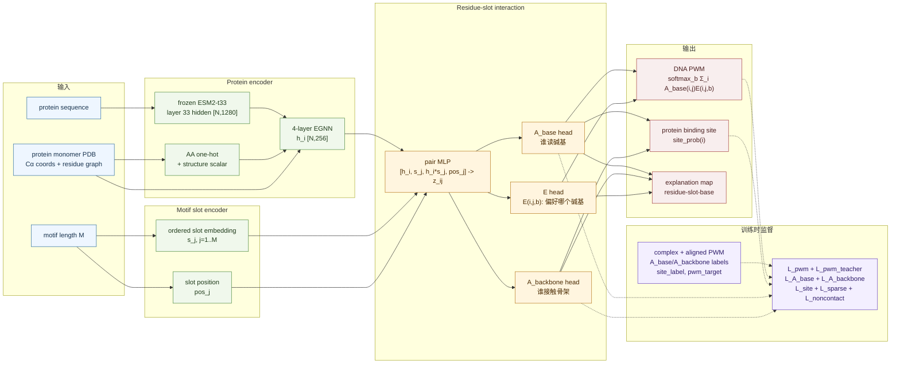

# 从 rCLAMPS、DeepPBS 到 Residue-Base Energy Model

## 一句话

这个项目不是单纯做 binding-site prediction，也不是单纯做 PWM prediction。

我们想学一个更底层的对象：

```text
哪个蛋白残基 i
影响 motif 哪一列 j
并且偏好这一列出现哪个碱基 b
```

对应几个核心输出：

```text
A_base(i,j): residue i 是否读取 motif slot j 的碱基
A_backbone(i,j): residue i 是否接触 motif slot j 的糖-磷酸骨架
A_contact(i,j): max(A_base(i,j), A_backbone(i,j))
E(i,j,b): residue i 对 motif slot j 上 base b 的偏好/能量分数
```

然后三个任务都从它们读出来：

| 任务 | 从哪里读 |
|---|---|
| DNA PWM | `PWM[j,b] = softmax_b Σ_i A_base(i,j) * E(i,j,b)` |
| protein binding site | 对每个 residue `i` 聚合 `A_contact(i,j)` |
| residue-base 解释图 | 直接看高分 `A_base(i,j)` 和 `E(i,j,b)` |

## 第一性原理

蛋白-DNA 结合特异性最核心的问题不是“这个蛋白 bind 不 bind DNA”，而是：

> 蛋白表面的哪些残基，在读 DNA motif 的哪些位置，以及它们偏好 A/C/G/T 哪个碱基？

所以我们需要同时保留三件事：

| 维度 | 含义 | 如果丢掉会怎样 |
|---|---|---|
| `i` | 蛋白 residue | 只剩 motif，解释不了 protein binding site |
| `j` | motif 位置 | 只知道 residue 重要，不知道它读第几列 |
| `b` | A/C/G/T | 只知道接触，不知道序列特异性 |

因此，真正想学的是 residue-slot-base compatibility：

```text
E(i,j,b)
```

但 `E` 不能单独用，还要知道哪个 residue 对哪个 motif slot 的碱基负责，所以加：

```text
A_base(i,j)
```

直觉：

```text
A_base(i,j) 负责“谁读哪一列的碱基”
E(i,j,b) 负责“这一列偏好哪个碱基”
```

## 从 rCLAMPS 出发

rCLAMPS 给了我们最重要的思想：**residue 和 PWM column 之间应该有对应关系**。

rCLAMPS 大概做的是：

```text
同一家族 TF 序列 + PWM
        ↓
手工/结构给定 contact map
        ↓
搜索 PWM 的 start/rev 对齐
        ↓
学习 amino acid position -> base preference
        ↓
预测 PWM
```

它的核心对象可以理解成：

```text
某个固定蛋白位置的氨基酸
对某个固定 DNA/PWM 位置的 A/C/G/T 概率有什么影响
```

这和我们的 `E(i,j,b)` 很像。

| rCLAMPS | 我们这里 |
|---|---|
| family-specific contact map | learned `A_base(i,j)` / `A_backbone(i,j)` |
| amino acid position | residue `i` |
| DNA/PWM position | motif slot `j` |
| logistic recognition code | energy-like `E(i,j,b)` |
| predicted PWM | predicted PWM |

关键升级是：

```text
rCLAMPS 的 contact map 是人给的；
我们希望把 contact map 交给 PLM + EGNN 学出来。
```

也就是：

```text
手工 contact map
        ↓
learned differentiable A_base(i,j) / A_backbone(i,j)
```

### rCLAMPS 的不足

| 不足 | 影响 |
|---|---|
| contact map 依赖家族和结构先验 | 换家族要重新设计 |
| 只看少数对齐后的关键位置 | 蛋白整体结构信息用得少 |
| 模型偏线性 | 难表达复杂 residue-residue context |
| 主要输出 PWM | 不直接输出 protein binding site |
| 训练时要处理 start/rev 隐变量 | 对齐噪声大 |

所以我们的第一步不是抛弃 rCLAMPS，而是把它最有价值的思想神经网络化：

```text
recognition code -> E(i,j,b)
contact map -> A_base(i,j) / A_backbone(i,j)
```

## 从 DeepPBS 出发

DeepPBS 给了另一个重要启发：**可以从蛋白-DNA 三维结构预测 DNA motif/PWM**。

DeepPBS 的逻辑大概是：

```text
protein-DNA complex
        ↓
蛋白原子图 + DNA coarse-grained points
        ↓
protein-DNA 几何交互
        ↓
输出 DNA helix 每个位置的 PWM
```

它强在用了真实结构几何。

但它和我们的目标有一个根本区别：

| 问题 | DeepPBS | RBE |
|---|---|---|
| 推理输入 | protein-DNA complex | protein monomer + motif length |
| `j` 是什么 | 输入 DNA helix 上的真实位置 | 模型内部的 motif slot |
| DNA 坐标 | 推理必须给 | 推理不给 |
| 输出解释 | 主要是 DNA-side PWM | PWM + protein site + `A/E` map |

DeepPBS 的 `j` 已经被输入复合物里的 DNA 坐标固定了。

我们的难点是：

```text
推理时没有 DNA，
所以 motif slot j 必须由模型内部生成。
```

因此不能直接在 DeepPBS 上加一个 head。

我们从 DeepPBS 借的是：

| DeepPBS 给的启发 | 我们怎么用 |
|---|---|
| 结构能帮助 PWM prediction | 用 protein structure + EGNN |
| 复合物能提供 residue-DNA 接触监督 | 训练时生成 `A_base_label/A_backbone_label/A_contact_label` |
| PWM 是合理输出目标 | 保留 `L_pwm` |

但我们删除了 DeepPBS 推理时对 DNA 坐标的依赖。

## 从 EquiPPIS / EquiPNAS / MegSite 出发

这些方法的共同价值是：

```text
PLM embedding + structure graph/EGNN
可以很好地做 protein-side binding site prediction
```

它们一般回答：

```text
residue i 是不是 binding residue？
```

也就是输出：

```text
site_prob(i)
```

这对我们很有用，但还不够。

| 方法类型 | 强项 | 不足 |
|---|---|---|
| EquiPPIS / EquiPNAS 类 | PLM + EGNN 学 protein interface | 通常不输出 DNA PWM |
| MegSite 类 | 多模态 PLM + GNN 做核酸 binding site | 主要是 residue-level binary classification |
| 我们 | 同时输出 site、PWM、residue-slot-base map | V1 数据和 slot 定义还很粗 |

所以我们吸收的是 protein encoder：

```text
ESM2 hidden embedding + residue graph + EGNN
```

但输出不止是 binding site，而是：

```text
A_base(i,j)
A_backbone(i,j)
E(i,j,b)
PWM(j,b)
site_prob(i)
```

## 合起来的模型

最终 V1 是这样来的：

```text
rCLAMPS:
  residue-position-base recognition code
        ↓
  变成 E(i,j,b)

rCLAMPS:
  manual contact map
        ↓
  变成 learned A_base(i,j) / A_backbone(i,j)

DeepPBS:
  structure-conditioned PWM prediction
        ↓
  保留 PWM readout，但去掉推理时 DNA coords

EquiPNAS/MegSite:
  PLM + EGNN 做 protein-side binding site
        ↓
  作为 protein encoder 和 site readout
```

当前模型：

```text
protein monomer structure + ESM2 embedding
        ↓
EGNN
        ↓
residue embedding h_i

motif length M
        ↓
ordered slot embedding s_j

h_i + s_j
        ↓
pair representation z_ij
        ↓
A_base(i,j), A_backbone(i,j), E(i,j,b)
        ↓
PWM[j,b], A_contact(i,j), site_prob[i]
```

## 训练和推理的区别

| 阶段 | 能不能用 protein-DNA complex | 用来干什么 |
|---|---|---|
| 训练 | 能 | 生成 `A_base_label/A_backbone_label/A_contact_label`、`site_label`、PWM target |
| 推理 | 不能 | 只输入 protein monomer PDB + motif length |

训练时：

```text
complex PDB + aligned PWM
        ↓
计算 residue-base contact
        ↓
A_base_label[i,j]
A_backbone_label[i,j]
A_contact_label[i,j]
site_label[i]
pwm_target[j,b]
```

推理时：

```text
monomer protein PDB + motif length M
        ↓
预测 A_base(i,j), A_backbone(i,j), A_contact(i,j), E(i,j,b), PWM, site_prob
```

## 当前代码对应关系

| 概念 | 代码 |
|---|---|
| 从 complex 生成 `A_base/A_backbone/A_contact/site/PWM` labels | `src/rbe/data/process_complex.py` |
| 读取 `.npz` 训练样本 | `src/rbe/data/dataset.py` |
| ESM2 hidden embedding | `src/rbe/data/esm.py` |
| residue graph / edge features | `src/rbe/data/features.py` |
| EGNN | `src/rbe/models/egnn.py` |
| `A_base/A_backbone/A_contact`、`E(i,j,b)`、PWM、site | `src/rbe/models/model.py` |
| `L_pwm + L_pwm_teacher + L_A_base + L_A_backbone + L_site + L_sparse + L_noncontact` | `src/rbe/losses.py` |
| 训练 | `src/rbe/train.py` |
| monomer 推理 | `src/rbe/predict.py` |
| PWM / site / A map 评估 | `src/rbe/eval/evaluate_pwm.py` |

## E 的可解释性约束

`E(i,j,b)` 没有直接实验标签。只有最终 PWM 标签时，多个 residue 的 `E` 可以互相替代，导致解释不唯一。

当前代码用两个额外约束降低这个问题：

| loss | 核心想法 |
|---|---|
| `L_pwm_teacher` | 训练时用真实 `A_base_label(i,j)` 门控 `E(i,j,b)` 来预测 PWM，强制 `E` 主要由真实 base-contact residue 解释 |
| `L_noncontact` | 惩罚非 base-contact residue 的 `A_base(i,j) * E(i,j,b)` 贡献，防止不读碱基的 residue 偷偷投票 |

直觉：

```text
原来：模型可以自己决定谁解释 PWM
现在：训练时先用真实接触关系告诉模型，哪些 residue 有资格解释对应 PWM 列
```

这样 `E` 仍然不是直接物理能量，但比只靠 `L_pwm` 更接近 residue-base recognition contribution。

当前 `A` 被拆成：

| 量 | 作用 |
|---|---|
| `A_base(i,j)` | 谁在读第 `j` 个碱基，用于 `PWM = softmax_b Σ_i A_base(i,j)E(i,j,b)` |
| `A_backbone(i,j)` | 谁接触第 `j` 个核苷酸的糖-磷酸骨架 |
| `A_contact(i,j)` | `max(A_base(i,j), A_backbone(i,j))`，用于 protein binding site |

## 当前 V1 的边界

这个版本只是最小闭环，不是最终论文级模型。

| 边界 | 当前状态 |
|---|---|
| DNA/RNA | 只做 DNA |
| motif length | 需要显式给 `M` |
| PWM-DNA 对齐 | 已加入 DeepPBS-style 自动 sequence alignment；默认用 IC-weighted log-likelihood，仍允许手动覆盖 |
| reverse-complement | 预处理会尝试 DNA chain 的反向互补；训练 loss 本身还不是 RC-aware |
| affinity / mutation effect | 还没做 |
| protein input | 需要 monomer PDB，不做 sequence-only |
| ESM2 | 用 frozen layer 33 hidden representation，不用 logits |

## 现在最薄弱的地方

第一性原理看，当前最弱的不是网络层数，而是 `j` 的定义。

| 短板 | 为什么关键 |
|---|---|
| PWM-DNA 自动对齐只看 DNA sequence | 如果 PWM 很弱或 PDB DNA 片段不完整，contact labels 仍可能错 |
| `j` 只是 ordered slot embedding | 还没有 DNA helix 几何先验 |
| contact labels 仍是距离弱标签 | 仍没区分氢键、水介导、major/minor groove |
| ESM2 还会在处理样本时现场跑 | 大数据会慢，需要缓存 |

所以 V1 的目标不是马上赢所有 benchmark，而是先证明：

```text
不用输入 protein-DNA complex，
只用 protein monomer，
能不能学到有意义的 A_base/A_backbone/A_contact、E(i,j,b)、PWM 和 protein site。
```

如果单样本 overfit 和小数据集 smoke test 都成立，下一步再补 RC-aware training、helix positional prior 和大规模 benchmark。
模型结构图：



人话版：

| 模块 | 在干嘛 |
|---|---|
| ESM2 + EGNN | 先理解每个蛋白残基处在什么序列和结构环境里，得到 `h_i` |
| motif slot embedding | 给 DNA motif 的每一列一个可学习的位置表示 `s_j` |
| pair MLP | 把每个残基 `i` 和每个 motif 位置 `j` 两两配对 |
| `A_base head` | 判断 residue `i` 有没有资格读 motif 第 `j` 列的碱基 |
| `A_backbone head` | 判断 residue `i` 有没有接触 motif 第 `j` 列的糖-磷酸骨架 |
| `E head` | 判断如果第 `j` 列是 A/C/G/T，residue `i` 更喜欢哪个 |
| PWM readout | 所有 residue 对每一列投票，汇总成 DNA PWM |
| site readout | 看每个 residue 是否对某些 motif 位置有强贡献，得到 protein binding site |
